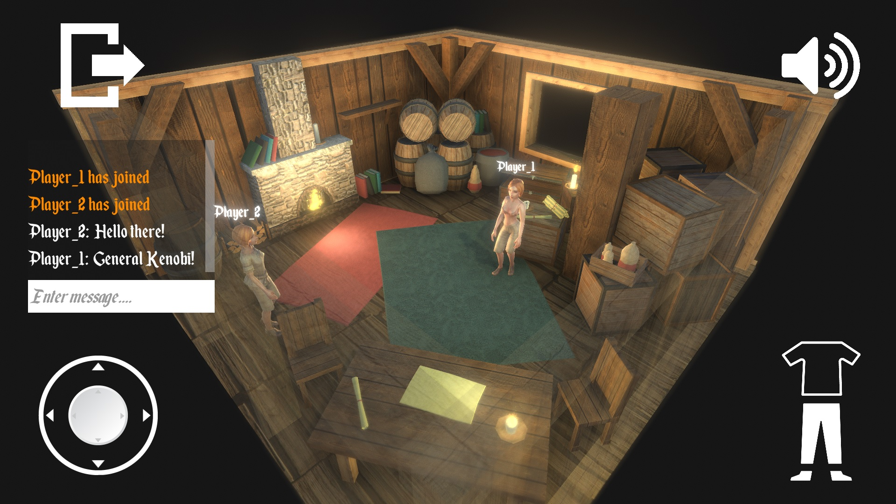

# TestTask
 
## Implemented functions:

- 3D Room with environment;
- Playable character. For the input the UI joystick is used;
- Character's idle and walk animations;
- Player's UI with joystick, buttons to equip/unequip clothes, mute button, chat and exit button;
- Main menu with imput fields for connection to lobby;
- Camera post processing to improve video quality;
- Sound effects and soundtrack;
- Multiplayer for 2 players, using Photon PUN.

## How to connect to another player?

Game needs to be connected to the Internet to work. First player needs to enter his Nickname (fonts, that were used supports only English letters), the game room name and press Host. Second player needs to enter his username and the same room name as first player and press Join.

## Screenshots:

