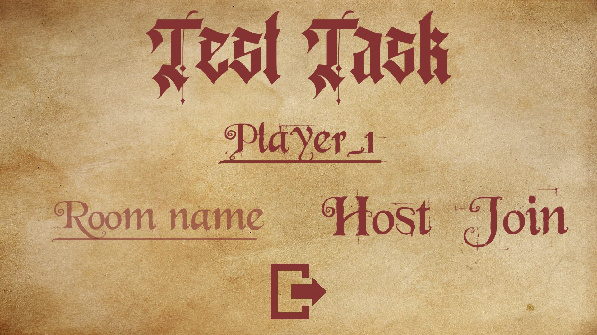

# TestTask
 
## Implemented functions:

- The 3D Room with an environment;
- A Playable character. To input the UI joystick is used;
- Character's idle and walk animations;
- A Player's UI with a joystick, buttons to equip/unequip clothes, a mute button, the chat and an exit button;
- A Main menu with input fields to connect to lobby;
- Camera post processing to improve the video quality;
- Sound effects and a soundtrack;
- A Multiplayer mode for 2 players, using Photon PUN.

## How to connect to another player?

This game needs to be connected to the Internet to function. First player needs to enter his Nickname (fonts, that were used support only English letters), the game room name and press Host. Second player needs to enter his username and the same room name as the first player and to press Join.

## Screenshots:

